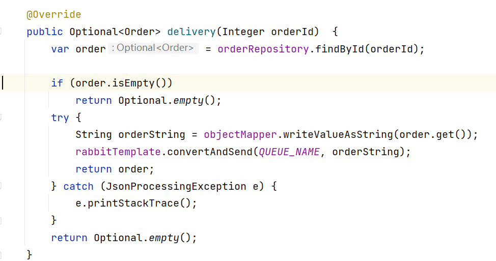
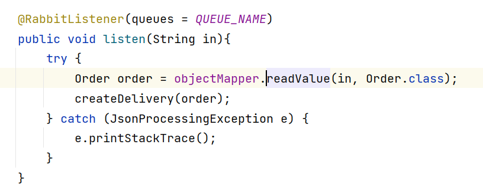
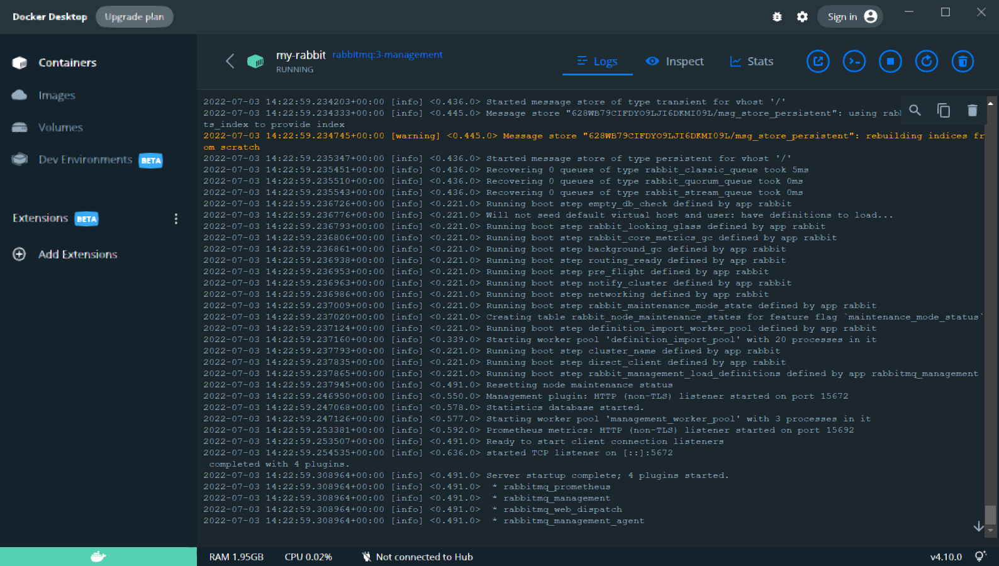

 # aw07

Please extend your MicroPOS system by adding a delivery service shown as the following figure.

## 设计
由于先加入及几个模块，加上以前使用spring-batch处理的亚马逊数据，所以在本次作业使用mysql作为数据库。数据库主要负责
存储order,product,delivery信息，其中delivery是用order信息生成的伪数据。cart信息，经过考虑决定不报错到数据，还是通过
cache的方式进行存储。具体的存储方式可以后期可以通过调整组件的方法来决定，可以使用redis，mongodb等nosql数据库。

## amqp
这是本次作业的主要创新点。在作业中我使用的rabbit。简单来说这是微服务器之间的管道，其可以提高微服务之间的通信吞吐量。
在本次作业中，有Order Service放入信息到管道之中，然后Delivery Service从管道之中取出信息，然后进行之后的处理。

如果aw05的直接进行通信的方式相比，个人认为最大的好处是通信双方不再需要相互等待，可以增加异步程度。这样可以避免一个微服务处理能力宕机或者达到负荷而引起另外一微服务，
出现问题。由于amqp的引入，其水平向拓宽能力会增强。但是与spring自带的路由管理和gateway相比，性能之间的差异，由于时间上比较仓促，所以为进行对比。

### 实现部分
#### 定义

#### 发送方

#### 接收方

#### docker运行情况
